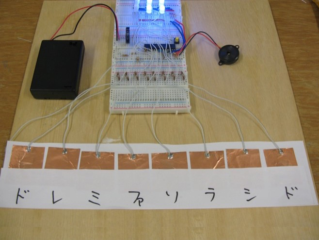

LED Organ
==========

八頭ものづくり教室(第四回)スケッチ

をもとに実装しているため，まわりくどいライブラリ・関数構成となっている．
余力があれば最適化する．もしくは誰かお願い．

Files
------

|ファイル名|内容|
|:-------|:---|
|RGB_matrix.ino|スケッチのメイン|
|led_fullcolor_3.h|9個のフルカラーLEDのライブラリ|
|digiRW.h|高速にIO処理を行うためのライブラリ|
|playMelodyStep.h|メロディの各情報を取り出すためのライブラリ|
|sounds.h|メロディを記述|
|touch.h|タッチセンサに関するライブラリ|
|README.md|このファイル|
|LICENCE|The MIT License|
|[reference]|参考プロジェクト|

Pins
------
|Pin番号|機能|
|:-----|:---|
|d0|
|d1|
|d2|left led cathode
|d3|
|d4|touch sensor common
|d5|green led anode
|d6|blue led anode
|d7|red led anode
|d8|buzzer
|d9|switch
|d10|middle led cathode
|d11|right led cathode
|d12|touch sensor C(8va)
|d13|touch sensor B
|d14(ai0)|touch sensor A
|d15(ai1)|touch sensor G
|d16(ai2)|touch sensor F
|d17(ai3)|touch sensor E
|d18(ai4)|touch sensor D
|d19(ai5)|touch sensor C

