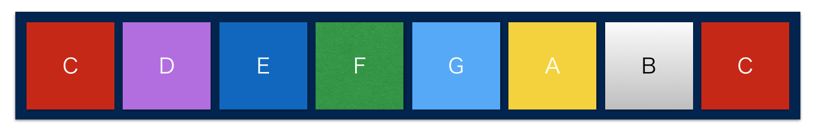

LED Organ
==========

八頭ものづくり教室(第四回)スケッチ
------


### 概要
1. タッチセンサの鍵盤に触れると，対応した音がなり，対応した色で光る．
2. LEDの指示に合わせて鍵盤に触れると，曲の演奏ができる
3. 2.の曲のデモ演奏
4. 1~3の3つのモードをタクトスイッチで切り替えできる

#### 色と音の対応



#### (注意)
[RGB_matrix](https://github.com/gitoku/RGB_matrix)をもとに実装しているため，まわりくどいライブラリ・関数構成となっている．
余力があれば最適化する．もしくは誰かお願い．

#### デモ
次のモードがタクトスイッチ長押し(1秒程度)のたびに切り替わる

1. **自由演奏**：触れたセンサの音が再生され，対応する色にLEDが光る
2. **曲演奏デモ**(たきび)：いずれかのキーに触れていれば曲を再生する
2. **ガイド演奏**(たきび)：LEDが指示する色のセンサに触れれば，曲が再生される
2. **曲演奏デモ**(Let It Go)
2. **ガイド演奏**(Let It Go)
2. **曲演奏デモ**(千本桜)
2. **ガイド演奏**(千本桜)

Files
------

|ファイル名|内容|
|:-------|:---|
|RGB_matrix.ino|スケッチのメイン|
|led_fullcolor_3.h|9個のフルカラーLEDのライブラリ|
|digiRW.h|高速にIO処理を行うためのライブラリ|
|playMelodyStep.h|メロディの各情報を取り出すためのライブラリ|
|sounds.h|メロディを記述|
|touch.h|タッチセンサに関するライブラリ|
|README.md|このファイル|
|LICENCE|The MIT License|
|[reference]|参考プロジェクト|


Pins
------
|Pin番号|機能|
|:-----|:---|
|d0|
|d1|
|d2|left led cathode
|d3|
|d4|touch sensor common
|d5|green led anode
|d6|blue led anode
|d7|red led anode
|d8|buzzer
|d9|switch
|d10|middle led cathode
|d11|right led cathode
|d12|touch sensor C(8va)
|d13|touch sensor B
|d14(ai0)|touch sensor A
|d15(ai1)|touch sensor G
|d16(ai2)|touch sensor F
|d17(ai3)|touch sensor E
|d18(ai4)|touch sensor D
|d19(ai5)|touch sensor C

曲リスト
-------

|曲|曲名|スケッチ内名称|
|:---|:---|:----------|
|曲1|四季の歌  |shikinouta|
|曲2|ハウルのメインテーマ  |haurunomaintame|
|曲3|たきび  |takibi|
|曲4|Wake up  |wakeup|
|曲5|RPG(sekai no owari)  |rpg|
|曲6|おぼろ月夜  |oboroduki|
|曲7|ニンジャりバンバン  |ninjaribanban|
|曲8|くつがなる  |kutsuganaru|
|曲9|みかんの花咲く丘  |mikannnohanasakuoka|
|曲10|千本桜(配信用)  |senbonzakura|
|曲11|箱根八里  |hakonehachiri|
|曲12|ジングルベル  |bell|
|曲13|We Wish You a Merry Christma  |merrychristmas|
|曲14|Let It Go(アナと雪の女王) |letitgo|


### 曲挿入用コード

#### 曲
```cpp
//曲1
melody.setMelody(shikinouta_Melody,shikinouta_Duration,shikinouta_Length);

//曲2
melody.setMelody(haurunomaintame_Melody,haurunomaintame_Duration,haurunomaintame_Length);

//曲3
melody.setMelody(takibi_Melody,takibi_Duration,takibi_Length);

//曲4
melody.setMelody(wakeup_Melody,wakeup_Duration,wakeup_Length);

//曲5
melody.setMelody(rpg_Melody,rpg_Duration,rpg_Length);

//曲6
melody.setMelody(oboroduki_Melody,oboroduki_Duration,oboroduki_Length);

//曲7
melody.setMelody(ninjaribanban_Melody,ninjaribanban_Duration,ninjaribanban_Length);

//曲8
melody.setMelody(kutsuganaru_Melody,kutsuganaru_Duration,kutsuganaru_Length);

//曲9
melody.setMelody(mikannnohanasakuoka_Melody,mikannnohanasakuoka_Duration,mikannnohanasakuoka_Length);

//曲10
melody.setMelody(senbonzakura_Melody,senbonzakura_Duration,senbonzakura_Length);

//曲11
melody.setMelody(hakonehachiri_Melody,hakonehachiri_Duration,hakonehachiri_Length);

//曲12
melody.setMelody(bell_Melody,bell_Duration,bell_Length);

//曲13
melody.setMelody(merrychristmas_Melody,merrychristmas_Duration,merrychristmas_Length);

//曲14
melody.setMelody(letitgo_Melody,letitgo_Duration,letitgo_Length);
```